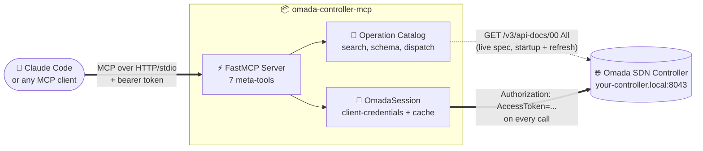
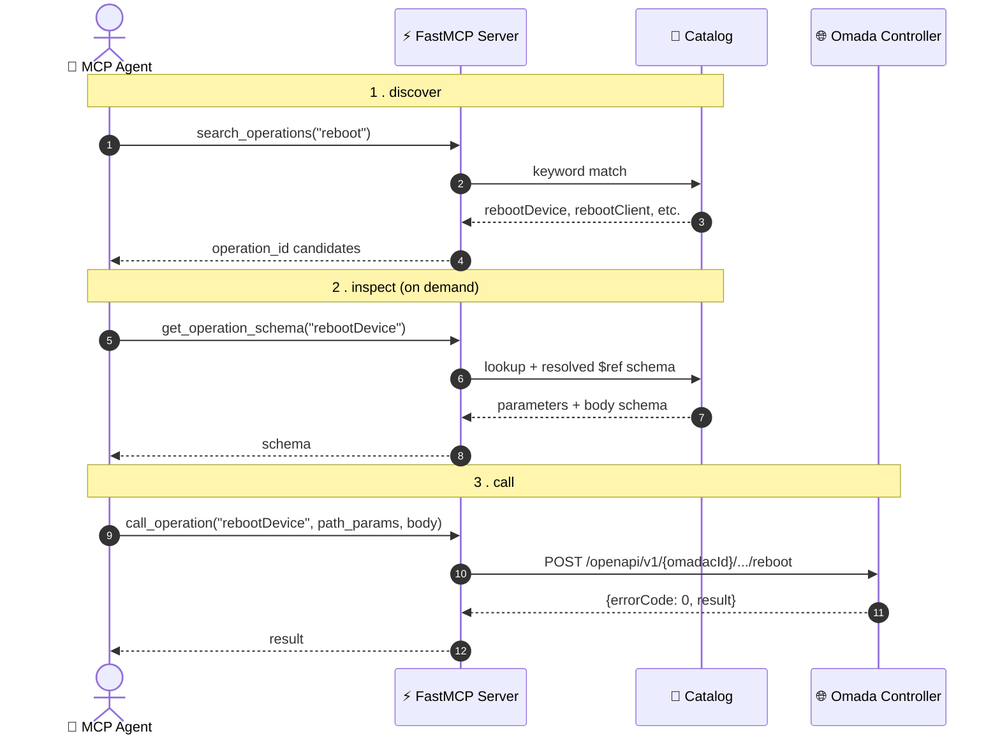

# omada-controller-mcp


MCP server for a TP-Link Omada SDN controller, so Claude Code and other MCP-aware agents can query and manage it directly. Includes a typed Python SDK generated from the controller's own live OpenAPI spec, plus a hand-written auth shim for Omada's non-standard client-credentials flow.

## Architecture



The Omada API has 2000+ operations, and the count changes across firmware versions. Rather than one MCP tool per operation, a small fixed set of meta-tools searches, inspects, and dispatches against a catalog built from the controller's own live spec:



Only `search_operations` / `get_operation_schema` results ever enter the agent's context, never all 2000+ schemas at once. Catalog tracks each controller's real API version automatically, no per-endpoint code to fall out of sync.

## Quickstart

```bash
uv sync
cp .env.example .env   # fill in OMADA_CLIENT_ID / OMADA_CLIENT_SECRET
export $(grep -v '^#' .env | xargs)
uv run omada-mcp
```

Or with Docker:

```bash
cp .env.example .env
./scripts/build_venv_for_docker.sh
docker compose up --build
```

Connect from Claude Code:

```bash
claude mcp add --transport http omada http://localhost:8000/mcp \
  --header "Authorization: Bearer $OMADA_MCP_AUTH_TOKEN"
```

`OMADA_BASE_URL` defaults to `https://your-controller.local:8043`, `OMADA_VERIFY_SSL` to `false` (self-signed LAN cert). Transport defaults to `stdio`; set `FASTMCP_TRANSPORT=http` for the HTTP/Docker path.

## Tools

| Tool | Purpose |
|---|---|
| 🔍 `search_operations(query)` | Find operations by keyword |
| 📋 `get_operation_schema(operation_id)` | Fetch one operation's parameters/body schema, on demand |
| 🚀 `call_operation(operation_id, path_params, query_params, body)` | Call any cataloged operation |
| 🔄 `refresh_catalog()` | Re-fetch the live spec after a firmware upgrade, no restart needed |
| ℹ️ `server_info()` | Which spec is loaded: live vs. bundled, version, operation count |
| 🏢 `list_sites()` | Convenience: sites this controller manages |
| 📡 `list_devices()` | Convenience: all APs, switches, gateways across every site |

## Layout

| Path | What's there |
|---|---|
| `src/omada_mcp/` | MCP server + operation catalog (spec loading, search, dispatch) |
| `src/omada_auth/auth.py` | `OmadaSession`: token fetch/cache, authenticated requests |
| `src/omada_client/` | Generated SDK, for direct Python use outside MCP. Don't hand-edit |
| `openapi/controller-spec.json` | Bundled spec, fallback only |
| `scripts/` | Regenerate the SDK, build the Docker deployment venv |
| `docs/SECURITY.md` | Trust model, zero-trust controls, credential handling |

## Security

Bearer token, rate limiting, DNS-rebinding protection, and audit logging are built in on the HTTP transport. See **[docs/SECURITY.md](docs/SECURITY.md)** for the full trust model and how to add TLS (reverse proxy or an overlay network like Tailscale). Credentials: env vars, `*_FILE` (Docker/K8s secrets), or `~/.omada.env`, never hardcoded.

## Using the SDK directly (no MCP)

```python
from omada_auth.auth import OmadaSession
from omada_client.api.ap import get_radios_config

session = OmadaSession(base_url="https://your-controller.local:8043", verify_ssl=False)
with session.client() as client:
    resp = get_radios_config.sync_detailed(
        omadac_id=session.omadac_id, site_id="...", ap_mac="...", client=client
    )
```

## Regenerating the SDK

```bash
curl -sk "https://your-controller.local:8043/v3/api-docs/00%20All" -o openapi/controller-spec.json
./scripts/regenerate.sh
```

The MCP server doesn't need this, it re-derives its catalog from the live spec every startup. Regeneration is only for the typed `omada_client` SDK.

## Tests

```bash
uv run python tests/test_auth.py
uv run python tests/test_catalog.py
```
