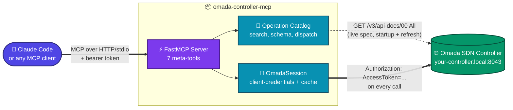
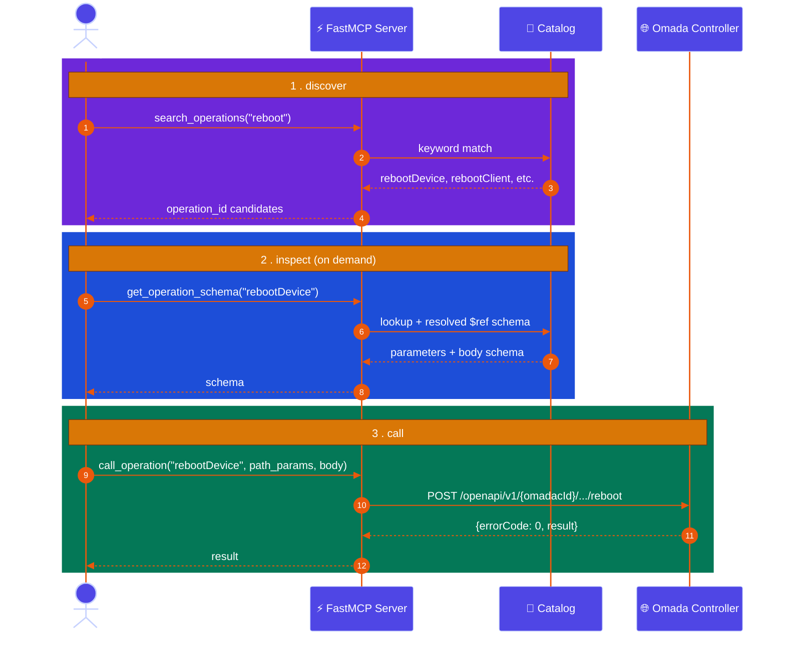

# omada-controller-mcp


MCP server for a TP-Link Omada SDN controller on the local LAN.

Lets Claude Code, and other MCP-aware agents, query and manage the controller directly.

Two parts:
- A typed Python SDK, generated from the controller's own live OpenAPI spec.
- A hand-written auth shim for Omada's non-standard client-credentials flow (`Authorization: AccessToken=...`). The spec declares no `securitySchemes`, so this couldn't be generated, it had to be wired by hand.

## Architecture



## Why not one MCP tool per endpoint

The Omada API has 2000+ non-deprecated, non-MSP operations. Call `server_info` for this controller's exact count.

That count also changes across firmware versions.

Registering one MCP tool per operation would put thousands of tool schemas in context before the agent asks anything. It would also hardcode a specific API version.

Instead, a small fixed set of meta-tools searches, inspects, and dispatches against a catalog built from the controller's own live spec:



Only `search_operations` and `get_operation_schema` results ever enter the agent's context. Never all 2000+ schemas at once.

## Tools

| Tool | Purpose |
|---|---|
| 🔍 `search_operations(query)` | Find operations by keyword |
| 📋 `get_operation_schema(operation_id)` | Fetch one operation's parameters/body schema, on demand |
| 🚀 `call_operation(operation_id, path_params, query_params, body)` | Call any cataloged operation |
| 🔄 `refresh_catalog()` | Re-fetch the live spec after a firmware upgrade, no restart needed |
| ℹ️ `server_info()` | Which spec is loaded: live vs. bundled, version, operation count |
| 🏢 `list_sites()` | Convenience: sites this controller manages |
| 📡 `list_devices()` | Convenience: all APs, switches, gateways across every site |

The operation catalog is built from whichever OpenAPI spec the controller actually serves at startup. It falls back to the bundled snapshot only if the controller is unreachable.

That means the tool surface tracks this controller's real API version automatically. No per-endpoint code to fall out of sync as Omada adds, changes, or removes operations.

## Layout

| Path | What's there |
|---|---|
| `src/omada_mcp/` | The MCP server (`server.py`) and operation catalog (`catalog.py`: spec loading, search, dispatch) |
| `src/omada_auth/auth.py` | `OmadaSession`: fetches `omadacId`, fetches and caches an access token, makes authenticated requests |
| `src/omada_client/` | Generated SDK (typed wrapper per operation), for direct Python use outside the MCP server. Don't hand-edit; regenerate instead |
| `openapi/controller-spec.json` | Bundled spec snapshot, used as a fallback if the controller can't be reached at startup, and as the source for `scripts/regenerate.sh` |
| `scripts/regenerate.sh` | Regenerate `src/omada_client` from the spec |
| `scripts/build_venv_for_docker.sh` | Resolve locked deps into `.venv-docker`, for the Dockerfile to copy in |
| `examples/get_radio_config.py` | Minimal direct-SDK usage example |

## Run locally

```bash
uv sync
cp .env.example .env   # fill in OMADA_CLIENT_ID / OMADA_CLIENT_SECRET
export $(grep -v '^#' .env | xargs)
uv run omada-mcp
```

Credentials, in priority order:
- `OMADA_CLIENT_ID` / `OMADA_CLIENT_SECRET` env vars.
- `OMADA_CLIENT_ID_FILE` / `OMADA_CLIENT_SECRET_FILE`, pointing at a file. This is the Docker/Kubernetes secrets convention, also works with a Vault agent or anything else that mounts a file.
- `~/.omada.env`, as a last-resort local-dev fallback.

Never hardcode these. Never pass them as CLI args either, they're visible in `ps`/process listings.

See Settings -> Open API in the Omada controller UI to create a client-credentials app.

`OMADA_BASE_URL` defaults to `https://your-controller.local:8043`.

`OMADA_VERIFY_SSL` defaults to `false`, because of the self-signed LAN cert. See `src/omada_auth/auth.py` for why.

Transport defaults to `stdio`. For an agent that connects over HTTP, set `FASTMCP_TRANSPORT=http` (`FASTMCP_HOST` / `FASTMCP_PORT` also available, see [FastMCP settings](https://gofastmcp.com)).

## Run with Docker

```bash
cp .env.example .env   # fill in OMADA_CLIENT_ID / OMADA_CLIENT_SECRET
./scripts/build_venv_for_docker.sh
docker compose up --build
```

The Dockerfile doesn't install anything itself.

`build_venv_for_docker.sh` resolves dependencies into `.venv-docker` first, targeting linux/amd64 regardless of host OS. `docker build` only copies that in.

CI does the same thing, plus a dependency scan (`pip-audit`) and an image scan (Trivy), before it pushes to Docker Hub. See `.github/workflows/ci.yml`.

Serves streamable-HTTP on `:8000` (`/mcp`). Point any MCP client at `http://<host>:8000/mcp`.

## Connect from Claude Code

```bash
claude mcp add --transport http omada http://localhost:8000/mcp \
  --header "Authorization: Bearer $OMADA_MCP_AUTH_TOKEN"
```

Or run `uv run omada-mcp` directly with `FASTMCP_TRANSPORT=stdio`, and add it as a stdio server instead. No Docker, no token, required.

## 🔒 Trust model

`call_operation` can reach every cataloged operation, including destructive ones (device reboot, config changes).

It does this using this server's own client-credentials session. It doesn't ask the MCP client to re-authenticate per call.

So: whoever can reach this server can drive the whole Omada API.

**stdio** (local `uv run omada-mcp`): that's whoever can run this process. Same trust boundary as running the CLI/SDK directly.

**HTTP** (the Docker/`docker compose` deployment): the container binds `0.0.0.0:8000`, so other machines on the LAN can reach it. That's the point, agents running elsewhere on your network can use it.

Without `OMADA_MCP_AUTH_TOKEN` set, that port is unauthenticated. Anything on the same LAN segment (a compromised IoT device, an unisolated guest-WiFi client) can drive the whole Omada API with no credential of its own.

Set `OMADA_MCP_AUTH_TOKEN` (see `.env.example`) before exposing this beyond `localhost`. `docker-compose.yml` refuses to start without it.

This is a single shared-secret bearer token, not OAuth. Enough to stop opportunistic LAN access. Not a substitute for network segmentation if your LAN itself isn't trusted.

## Zero trust on an untrusted LAN

Don't trust the network. Verify every request. Log everything. What's already built in, on the HTTP transport:

- **Bearer token**, above. Constant-time comparison, so timing attacks don't leak it.
- **Rate limiting**, `RateLimitingMiddleware`. Defends against brute force and request floods. Tune with `OMADA_MCP_RATE_LIMIT` (default 20 req/s).
- **DNS-rebinding / Host header protection**, FastMCP's built-in `host_origin_protection="auto"`. Stops a malicious webpage's JS from using your browser as a proxy into your LAN. Lock it down further with `OMADA_MCP_ALLOWED_HOSTS`.
- **Audit logging**, `StructuredLoggingMiddleware`. Every tool call, with arguments, goes to stderr as structured JSON. Assume breach, keep a record.

What's deliberately not built in: **transport encryption**. This server speaks plain HTTP; the bearer token above travels in cleartext unless you add TLS yourself. Two ways to do that, don't reinvent either:

- **Reverse proxy** (Caddy, nginx, Traefik) in front of this server, terminating TLS. Caddy in particular gets you automatic HTTPS (real cert if you have a domain, self-signed otherwise) in about 3 lines of Caddyfile.
- **Overlay network** (Tailscale, WireGuard). Don't expose port 8000 to the LAN at all, only to the overlay. Then "untrusted LAN" stops being the threat model, since the traffic never touches it.

Pick one if your LAN has devices you don't fully trust. On a small, single-user home network, the bearer token alone is a reasonable floor, just not the ceiling.

## Using the SDK directly (no MCP)

```python
from omada_auth.auth import OmadaSession
from omada_client.api.ap import get_radios_config

session = OmadaSession(base_url="https://your-controller.local:8043", verify_ssl=False)
with session.client() as client:
    resp = get_radios_config.sync_detailed(
        omadac_id=session.omadac_id, site_id="...", ap_mac="...", client=client
    )
```

`OmadaSession` resolves `*.local` hostnames to IPv4 explicitly. httpx has no happy-eyeballs fallback, and link-local IPv6 advertised over mDNS is often unroutable.

## Regenerating the SDK

If the controller firmware changes:

```bash
curl -sk "https://your-controller.local:8043/v3/api-docs/00%20All" -o openapi/controller-spec.json
./scripts/regenerate.sh
```

The MCP server doesn't need this step. It re-derives its operation catalog from the controller's live spec on every startup, and on `refresh_catalog()`.

Regeneration is only for the typed `omada_client` SDK.

## Tests

```bash
uv run python tests/test_auth.py
uv run python tests/test_catalog.py
```
