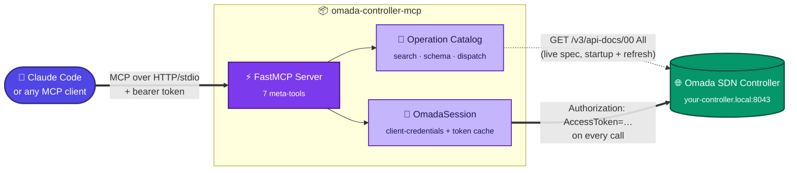
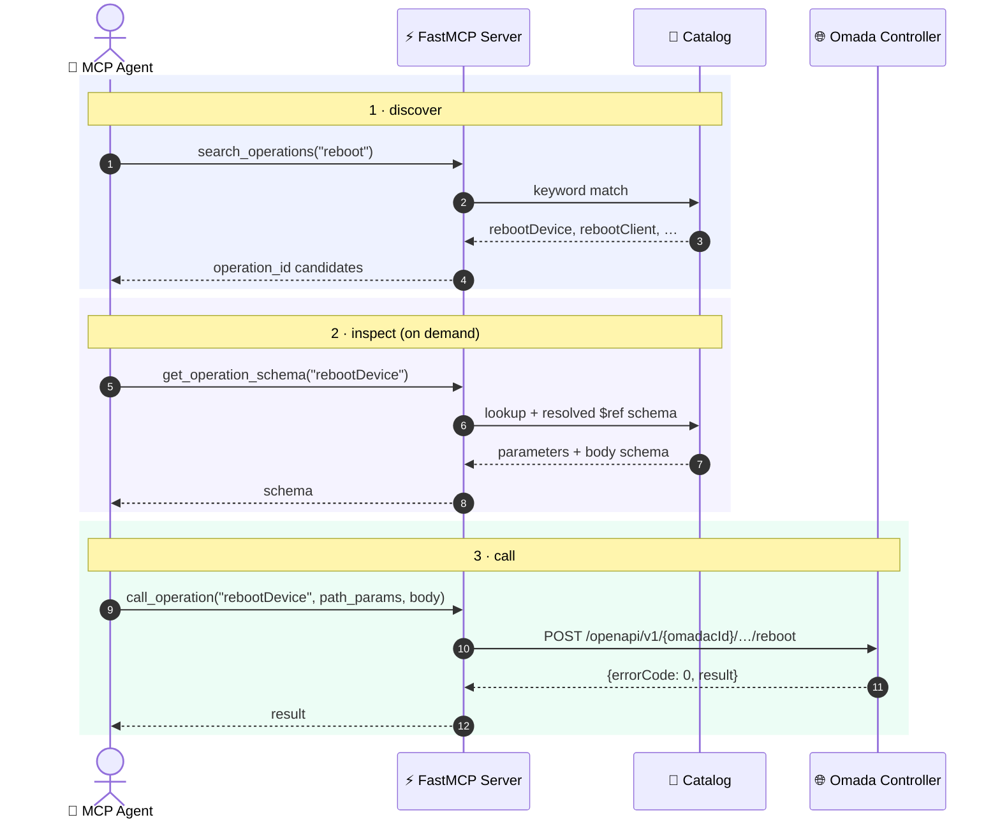

# omada-controller-mcp


MCP server for a TP-Link Omada SDN controller on the local LAN, so Claude
Code and other MCP-aware agents can query and manage it directly. Built on
a typed Python SDK generated from the controller's own live OpenAPI spec,
plus a hand-written auth shim for Omada's non-standard client-credentials +
`Authorization: AccessToken=` flow (the spec declares no `securitySchemes`,
so this has to be wired by hand).

<br>

## Architecture



<br>

## Why not one MCP tool per endpoint

The Omada API has 2000+ non-deprecated, non-MSP operations (call
`server_info` for this controller's exact count), and that count changes
across firmware versions. Registering one MCP tool per operation would put
thousands of tool schemas in context before the agent asks anything, and
would hardcode a specific API version. Instead, a small fixed set of
meta-tools searches, inspects, and dispatches against a catalog built from
the controller's own live spec:



Only `search_operations` and `get_operation_schema` results ever enter the
agent's context — never all 2000+ schemas at once.

<br>

## Tools

| Tool | Purpose |
|---|---|
| 🔍 `search_operations(query)` | Find operations by keyword |
| 📋 `get_operation_schema(operation_id)` | Fetch one operation's parameters/body schema, on demand |
| 🚀 `call_operation(operation_id, path_params, query_params, body)` | Call any cataloged operation |
| 🔄 `refresh_catalog()` | Re-fetch the live spec after a firmware upgrade, no restart needed |
| ℹ️ `server_info()` | Which spec is loaded — live vs. bundled, version, operation count |
| 🏢 `list_sites()` | Convenience: sites this controller manages |
| 📡 `list_devices()` | Convenience: all APs, switches, gateways across every site |

The operation catalog is built from whichever OpenAPI spec the controller
actually serves at startup (falling back to the bundled snapshot only if
the controller is unreachable), so the tool surface tracks that
controller's real API version automatically — no per-endpoint code to fall
out of sync as Omada adds, changes, or removes operations.

<br>

## Layout

| Path | What's there |
|---|---|
| `src/omada_mcp/` | The MCP server (`server.py`) and operation catalog (`catalog.py` — spec loading + search + dispatch) |
| `src/omada_auth/auth.py` | `OmadaSession`: fetches `omadacId`, fetches and caches an access token, makes authenticated requests |
| `src/omada_client/` | Generated SDK (typed wrapper per operation), for direct Python use outside the MCP server. Don't hand-edit; regenerate instead |
| `openapi/controller-spec.json` | Bundled spec snapshot — fallback if the controller can't be reached at startup, and source for `scripts/regenerate.sh` |
| `scripts/regenerate.sh` | Regenerate `src/omada_client` from the spec |
| `examples/get_radio_config.py` | Minimal direct-SDK usage example |

<br>

## Run locally

```bash
uv sync
cp .env.example .env   # fill in OMADA_CLIENT_ID / OMADA_CLIENT_SECRET
export $(grep -v '^#' .env | xargs)
uv run omada-mcp
```

Credentials come from `OMADA_CLIENT_ID` / `OMADA_CLIENT_SECRET` (env, or a
`~/.omada.env` file as fallback) — see Settings → Open API in the Omada
controller UI to create a client-credentials app. `OMADA_BASE_URL` defaults
to `https://your-controller.local:8043`; `OMADA_VERIFY_SSL` defaults to `false`
(self-signed LAN cert — see `src/omada_auth/auth.py` for why).

Transport defaults to `stdio`. For an agent that connects over HTTP, set
`FASTMCP_TRANSPORT=http` (`FASTMCP_HOST` / `FASTMCP_PORT` also available —
see [FastMCP settings](https://gofastmcp.com)).

<br>

## Run with Docker

```bash
cp .env.example .env   # fill in OMADA_CLIENT_ID / OMADA_CLIENT_SECRET
docker compose up --build
```

Serves streamable-HTTP on `:8000` (`/mcp`). Point any MCP client at
`http://<host>:8000/mcp`.

<br>

## Connect from Claude Code

```bash
claude mcp add --transport http omada http://localhost:8000/mcp \
  --header "Authorization: Bearer $OMADA_MCP_AUTH_TOKEN"
```

(Or run `uv run omada-mcp` directly with `FASTMCP_TRANSPORT=stdio` and add
it as a stdio server instead — no Docker, no token, required.)

<br>

## 🔒 Trust model

`call_operation` can reach every cataloged operation — including
destructive ones (device reboot, config changes) — using this server's own
client-credentials session; it doesn't ask the MCP client to re-authenticate
per call. So "whoever can reach this server" is "whoever can drive the
whole Omada API."

- **stdio** (local `uv run omada-mcp`): that's "whoever can run this
  process" — same trust boundary as running the CLI/SDK directly.
- **HTTP** (the Docker/`docker compose` deployment): the container binds
  `0.0.0.0:8000` so other machines on the LAN can reach it — that's the
  point, so agents running elsewhere on your network can use it. Without
  `OMADA_MCP_AUTH_TOKEN` set, that port is unauthenticated: anything on the
  same LAN segment (a compromised IoT device, an unisolated guest-WiFi
  client) can drive the whole Omada API with no credential of its own. Set
  `OMADA_MCP_AUTH_TOKEN` (see `.env.example`) before exposing this beyond
  `localhost` — `docker-compose.yml` refuses to start without it. This is a
  single shared-secret bearer token, not OAuth; enough to stop opportunistic
  LAN access, not a substitute for network segmentation if your LAN itself
  isn't trusted.

<br>

## Using the SDK directly (no MCP)

```python
from omada_auth.auth import OmadaSession
from omada_client.api.ap import get_radios_config

session = OmadaSession(base_url="https://your-controller.local:8043", verify_ssl=False)
with session.client() as client:
    resp = get_radios_config.sync_detailed(
        omadac_id=session.omadac_id, site_id="...", ap_mac="...", client=client
    )
```

`OmadaSession` resolves `*.local` hostnames to IPv4 explicitly — httpx has
no happy-eyeballs fallback, and link-local IPv6 advertised over mDNS is
often unroutable.

<br>

## Regenerating the SDK

If the controller firmware changes:

```bash
curl -sk "https://your-controller.local:8043/v3/api-docs/00%20All" -o openapi/controller-spec.json
./scripts/regenerate.sh
```

The MCP server doesn't need this step — it re-derives its operation
catalog from the controller's live spec on every startup (and on
`refresh_catalog()`). Regeneration is only for the typed `omada_client` SDK.

<br>

## Tests

```bash
uv run python tests/test_auth.py
uv run python tests/test_catalog.py
```
